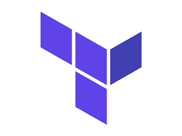
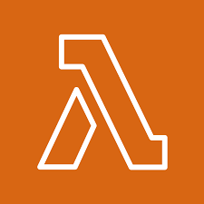
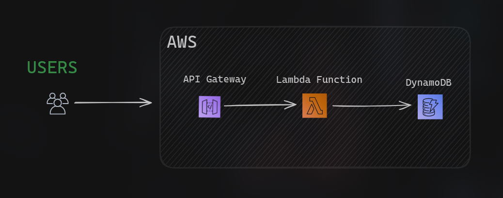

<!-- Title -->
<h1 align="center"> 🟪 Training the use of Terraform to create a lambda function </h1>

<!-- Short description -->
 

  
  
 

## Description

This project is a basic example of how to create a lambda function using TypeScript and Terraform. The lambda function is written in TypeScript and then transpiled to JavaScript for use by AWS Lambda. Terraform is used to create the necessary infrastructure on AWS and configure the lambda function.

## Technologies Used

- **Typescript (Javascript):** The primary programming language for the project.
- **Terraform:** Infrastructure as Code (IaC) tool used to provision AWS services.
- **AWS Services:**
  - **API Gateway:** Handles HTTP requests, serving as the entry point to the serverless architecture.
  - **Lambda Functions:** Enables serverless compute for efficient and scalable processing.
  - **DynamoDB:** NoSQL database service for scalable and low-latency data storage and retrieval.

## System Architecture

## To-do

- [ ] Add API Gateway terraform code
- [ ] Add DynamoDB terraform code
- [ ] Add a real lambda function
